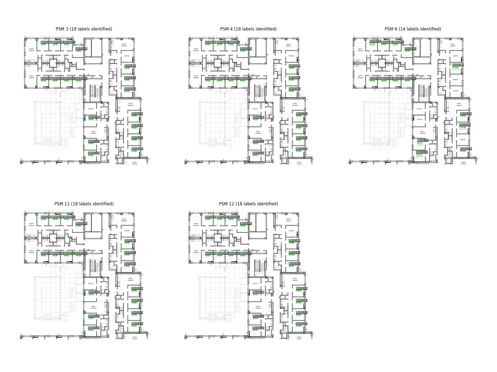
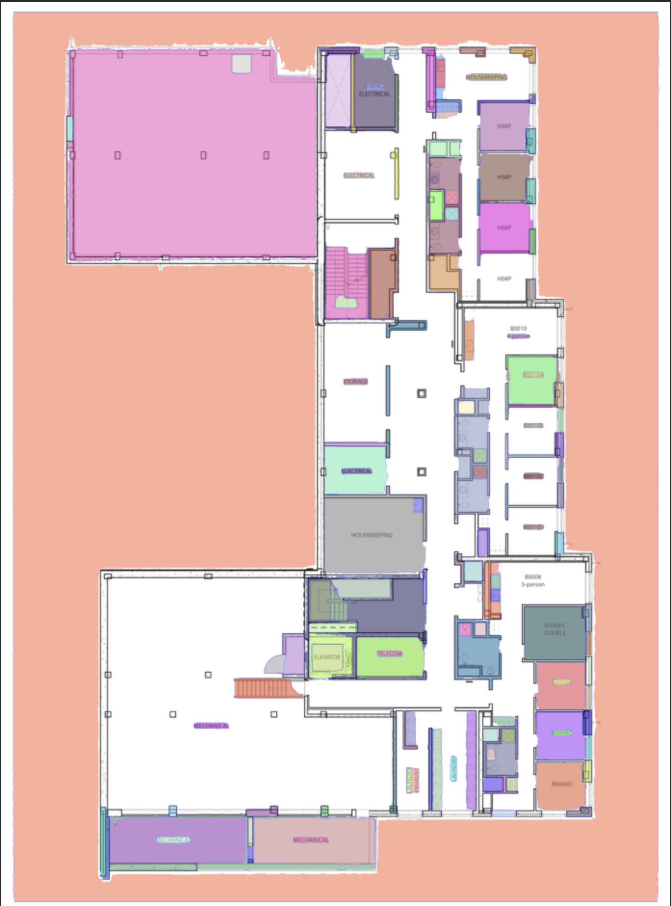
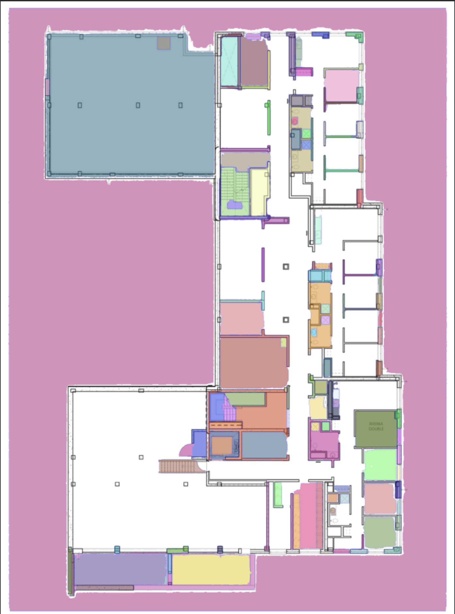
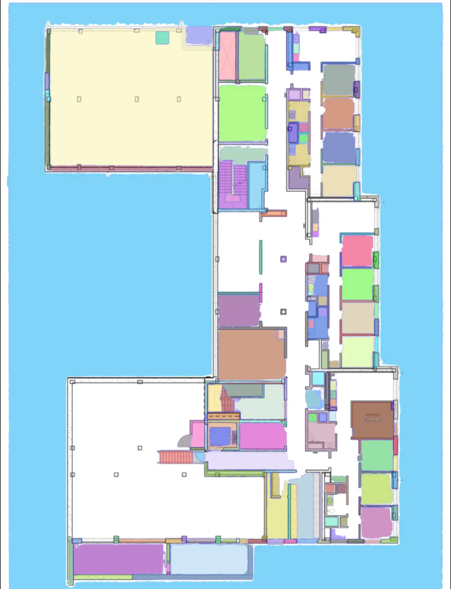
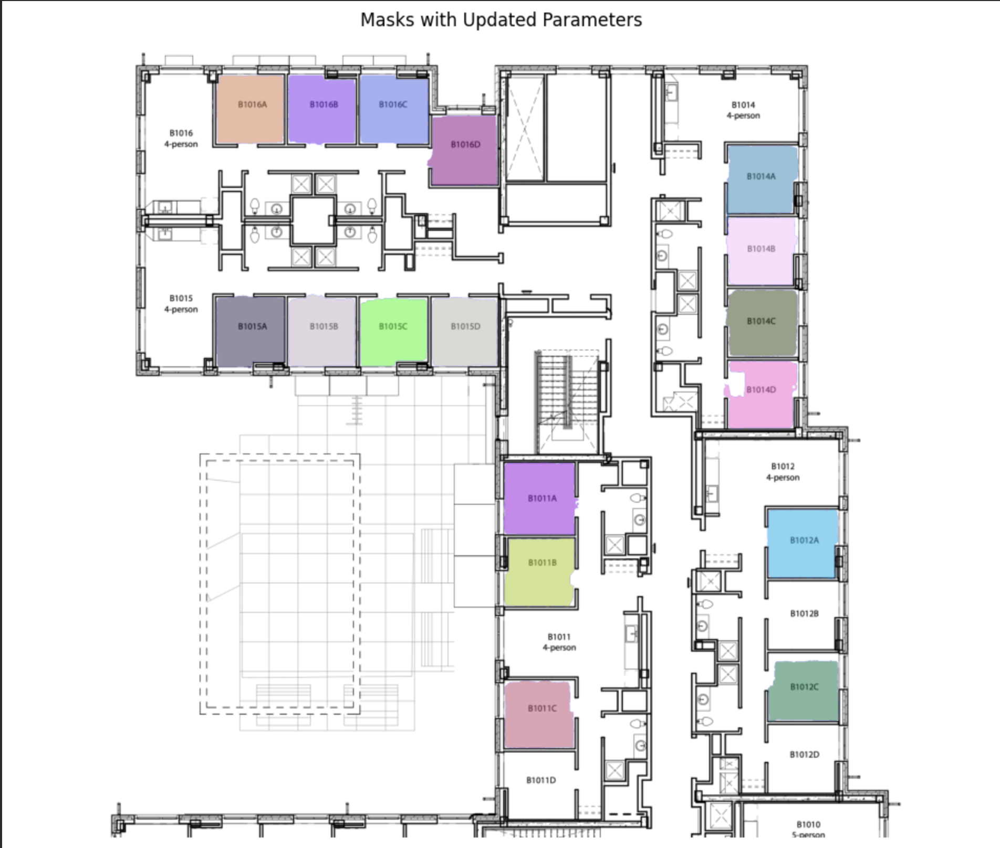
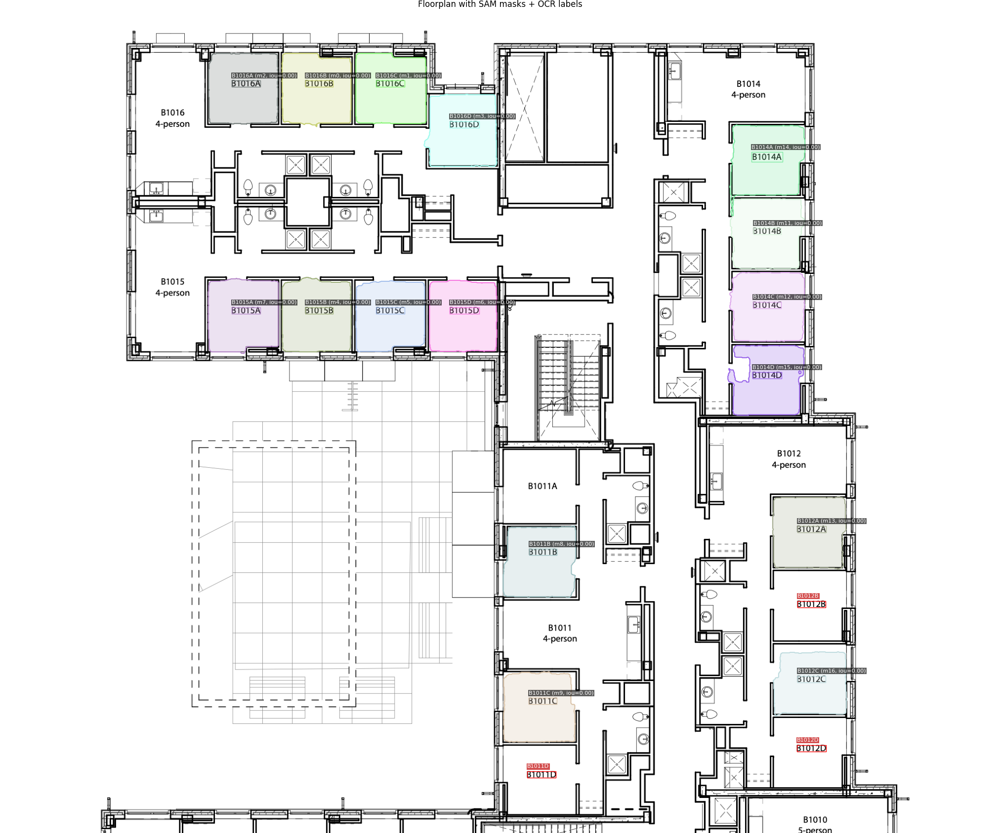
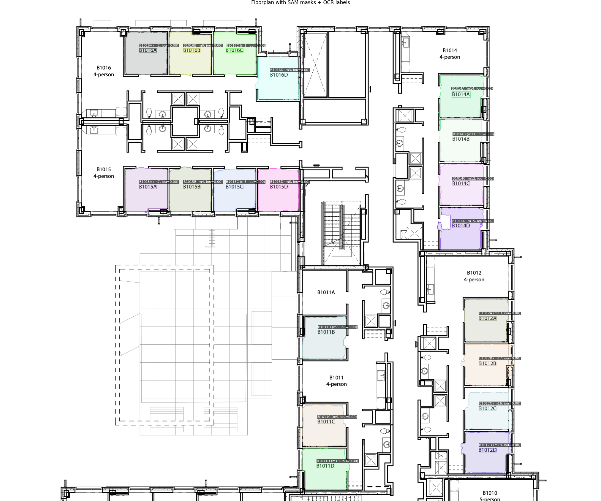

# Duke Housing Room Selection

https://sofaradkova.github.io/room-selector/

## What It Does

This project is meant to help Duke students pick rooms during the housing selection process. Right now when entering the housing portal we can only see the room numbers and have to constantly cross-reference them with floor plans published on a separate webpage and manually search for the right room. The choice has to be done under the constraint of a 5-minute selection time slot, so the project is meant to address this inconvenience. This is an MVP for one floor plan, but in the future, it will be extended to view floor plans for all Duke quads.

## Quick Start

1. **Install dependencies**

   ```bash
   conda env create -f environment.yml
   conda activate room-selector
   ```

2. **Download SAM 2.1 checkpoint**

   - Download `sam2.1_hiera_large.pt` from [Meta's SAM 2.1 releases](https://github.com/facebookresearch/sam2)
   - Place in `checkpoints/` directory

3. **Run the pipeline**

   ```bash
   python src/run_pipeline.py
   ```

4. **View the interface**
   - Open `src/index.html` in a web browser
   - Or visit: https://sofaradkova.github.io/room-selector/

See [SETUP.md](SETUP.md) for detailed installation instructions.

## Video Links

- [**Demo Video**](https://drive.google.com/file/d/143F9AvVv126VwEi8oijM3nrvnNg8PF86/view?usp=sharing)
- [**Technical Walkthrough**](https://drive.google.com/file/d/1sBXjLl_jCcEg7Asezgb8ZvYmrPuPDJFp/view?usp=sharing)

## Evaluation

### Quantitative Testing

#### Tesseract Page Segmentation Modes Comparison

I tested different page segmentation mode settings for Tesseract. All of them identified different numbers of text fragments in the floorplan but all except "--psm 6" found 18 labels that corresponded to room numbers.



#### OCR Models Comparison (Tesseract VS EasyOCR)

I chose to proceed with the combination of two models since Tesseract identified most room labels but still missed a few in some cases, which were caught by EasyOCR.

| floorplan_name | tesseract_identified | tesseract_filtered_out | easyocr_identified | easyocr_filtered_out | combined_labels | easyocr_contributed |
| -------------- | -------------------- | ---------------------- | ------------------ | -------------------- | --------------- | ------------------- |
| floorplan1     | 2                    | 34                     | 0                  | 24                   | 2               | 0                   |
| floorplan2     | 16                   | 46                     | 1                  | 36                   | 16              | 0                   |
| floorplan3     | 13                   | 57                     | 4                  | 39                   | 13              | 0                   |
| floorplan4     | 6                    | 57                     | 2                  | 30                   | 7               | 1                   |
| floorplan5     | 16                   | 70                     | 2                  | 43                   | 16              | 0                   |
| floorplan6     | 18                   | 35                     | 11                 | 26                   | 19              | 1                   |

### Qualitative Testing

#### Progression from default SAM run to the final matching with labels

With the text present, SAM identified a lot of extranious bounding boxes around text. Once the text was removed, fewer irrelevant masks were generated but a lot of rooms were still missing. After experimenting with different combinations of parameters, this was the best result that captured all rooms.

| SAM 2.1 Default      | SAM 2.1 No Text      | SAM 2.1 Best Parameters |
| -------------------- | -------------------- | ----------------------- |
|  |  |     |

To eliminate the masks that did not correspond to rooms, I experimented with filtering by height, width, and area finding the most accurate filter.



When masks were matched with labels initially, some labels remained unmatched (visualized in red), so their centroids and padded bounding boxes were passed into SAM to find masks in those specific image fragments.

| Initial Labels/Masks Match | Improved Labels/Mask Match |
| -------------------------- | -------------------------- |
|        |        |

## Contributions

This project was completed individualy by me and AI assistants.
